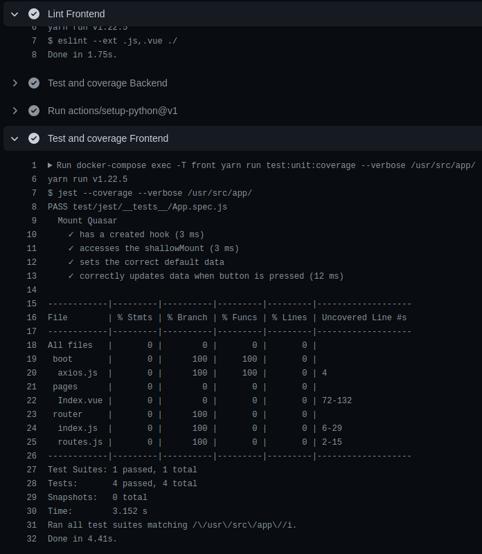
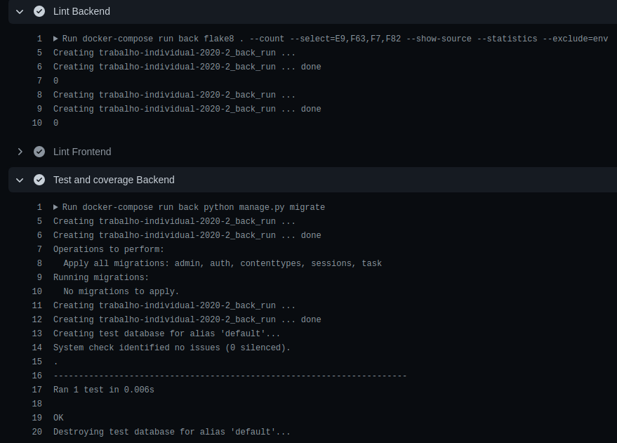
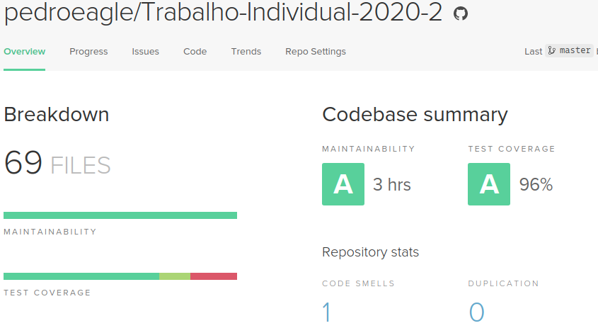
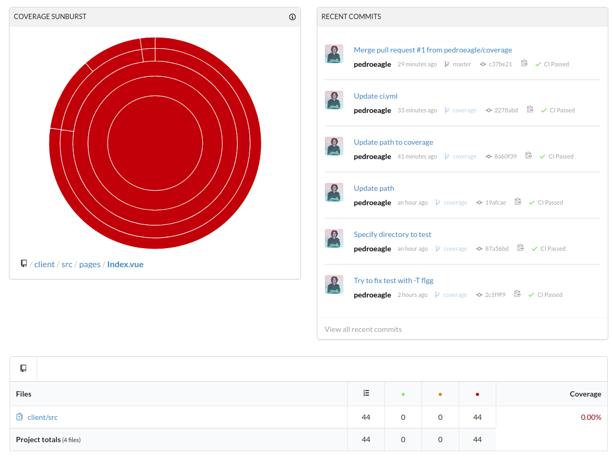

<a href="https://codeclimate.com/github/pedroeagle/Trabalho-Individual-2020-2/maintainability"></a>
<a href="https://codeclimate.com/github/pedroeagle/Trabalho-Individual-2020-2/test_coverage"></a>
[](https://codecov.io/gh/pedroeagle/Trabalho-Individual-2020-2)
[](https://github.com/pedroeagle/Trabalho-Individual-2020-2/actions/workflows/ci.yml)
[](https://github.com/pedroeagle/Trabalho-Individual-2020-2/actions/workflows/cd-client.yml)
[](https://github.com/pedroeagle/Trabalho-Individual-2020-2/actions/workflows/cd-api.yml)


# Trabalho Individual 2020.2
## 1. Containerização

Foi crado um docker para o front e outra para o back. Ambos são automatizados por meio do docker-compose. No docker-compose ainda é adicionada a imagem do Postgres.
Para testar basta dar clone no repositório e executar o seguinte comando:
```
docker-compose up --build
```
Será iniciados todos os containers e estarão disponíveis:
- O front no host http://localhost:8080/
- O back no host http://localhost:8000/task
- O postgres no host http://localhost:5432

Para finalizar a aplicação basta executar o seguinte comando:
```
docker-compose down
```

## 2. Integração contínua (Front-end)
Foi utilizado o Github Actions para criação do workflow de integração contínua. Nele é construído todo o projeto por meio do docker compose. É avaliado o lint além dos testes unitários. Caso a branch avaliada seja a master é enviado um relatório de cobertura de testes para o CodeCov.



## 3. Integração contínua (Back-end)
Foi utilizado o Github Actions para criação do workflow de integração contínua. Nele é construído todo o projeto por meio do docker compose. É avaliado o lint além dos testes unitários. Caso a branch avaliada seja a master é enviado um relatório de cobertura de testes para o CodeClimate.



## 4. Coverage (Extra)
Os relatório são enviados assim que os testes são executados conforme mencionado nos pontos 2 e 3.<br>

### Back-end
<br>
### Front-end


## 5. Deploy contínuo (Extra)
É realizado o deploy contínuo no Heroku a cada build da master. O deploy é feito por meio da imagem docker do back e do front. Para o banco de dados foi utilizada própria imagem disponibilizada pelo [Heroku](https://devcenter.heroku.com/articles/heroku-postgresql).

- Link do Front: https://pedroeagle-gces.herokuapp.com
- Link do Back: https://pedroeagle-api.herokuapp.com/task/
- Link do Postgres: https://pedroeagle-postgres.herokuapp.com/
